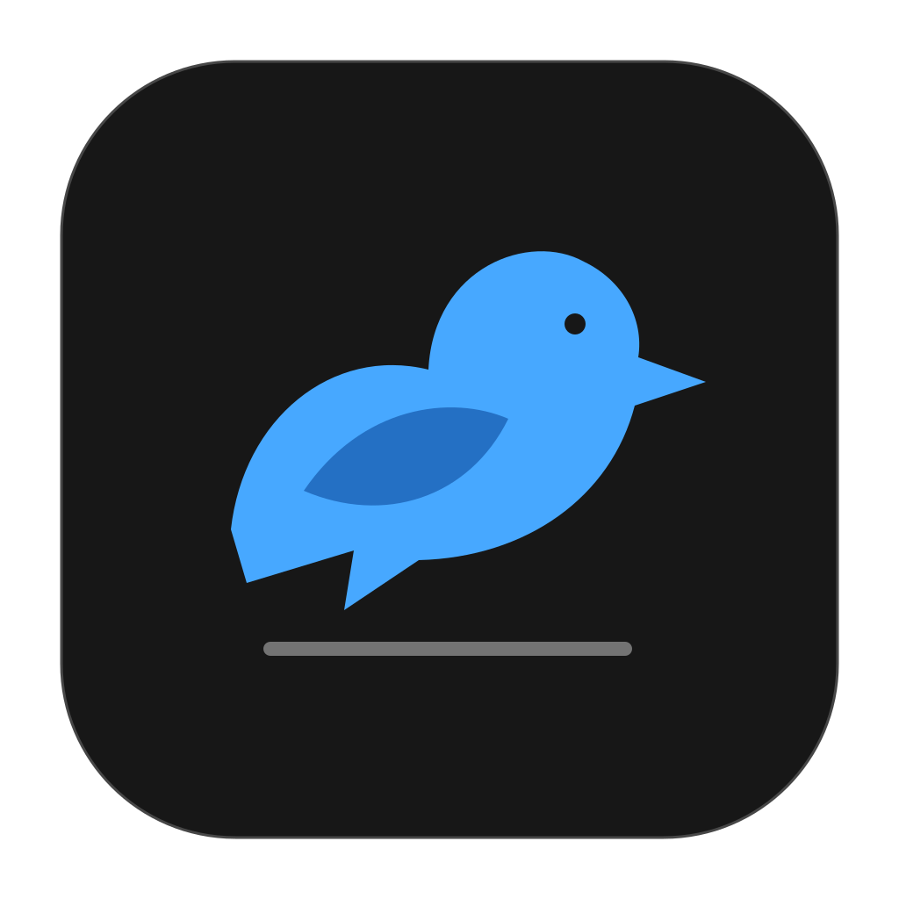
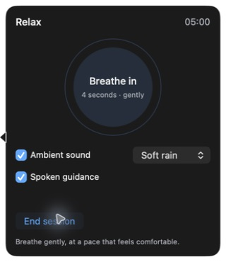
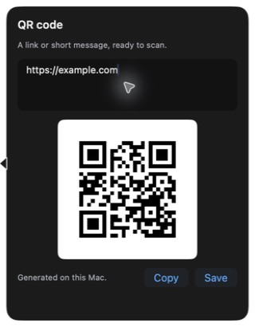

<p align="center"></p>
<h1 align="center">Perch</h1>
<p align="center">A little dock for the things you do all day.</p>
<p align="center"><a href="https://github.com/606scat/perch/releases/latest/download/Perch.dmg"><strong>Download for Mac</strong></a> · <a href="docs/INSTALL.md">Install & update</a> · <a href="https://github.com/606scat/perch/issues">Feedback</a></p>
<p align="center">macOS 14+ · Apple Silicon & Intel · Free & open source</p>

Keep notes, tasks, files, and a few small distractions at the edge of your screen. Hover to open a widget. Move away to tuck it back. Drag the dock to any of your display’s four edges.

Perch is signed with Developer ID and notarized by Apple. Download the disk image, drag it to Applications, and open it. Future updates are available from the menu-bar bird.

<p align="center"> &nbsp; </p>

## Make room for your tools

Start with Notes, Today, Focus, File Tray, Snippets, and Projects. Click **+** to choose from 20 widgets, set shortcuts, and arrange the dock. The picker puts everyday tools first and the playful ones at the bottom. Your own order stays yours.

| Everyday | What you can do |
| :--- | :--- |
| **Notes** | Capture a thought, keep a draft, and edit it later. |
| **Today** | Choose an Apple Reminders list and pin your top three tasks. |
| **Focus** | Set a timer, pause it, and return to the same session after a restart. |
| **File tray** | Drag files in, preview them, and drag them into another app. Originals stay where they are. |
| **Clipboard** | Keep copied text with a click, then copy it again when you need it. |
| **Snippets** | Save replies, links, and text you reuse. |
| **Projects** | Open a group of links, apps, files, or folders. |
| **Calculator** | Work through expressions and reuse recent results. |
| **Converter** | Convert length, weight, temperature, speed, data sizes, and time. |
| **World clock** | Compare cities and find a meeting time across time zones. |
| **Keep awake** | Keep your Mac awake for a set time, with an optional display setting. |
| **Habits** | Check in each day and see your streak and past week. |
| **Countdowns** | Count down to a date, or see how many days have passed. |
| **Color picker** | Sample a screen color, keep swatches, and copy hex or RGB. |
| **QR code** | Turn a link or message into a QR image you can copy or save. |
| **Text tools** | Count words and characters, change case, or remove duplicate lines. |

| A small break | What you can do |
| :--- | :--- |
| **Relax** | Take five minutes of guided breathwork or a quiet pause. Add soft rain, ocean, warm tones, brown noise, or spoken guidance. |
| **Quick decisions** | Flip a coin, roll a die, or pick from your own list. |
| **Doodle** | Draw on a tiny canvas and save a PNG. |
| **Tiny garden** | Water a plant each day and help it grow by finishing focus sessions. |

## Feels at home on your Mac

- Choose **Light, Dark, or System**, six accent colors, and glass or solid backgrounds.
- Open Quick Capture with **Control–Option–Space**. Give each widget its own shortcut in the picker.
- Click the active tile again, press Escape, or click outside to close its panel. Editing and file dialogs keep it open.
- Use the menu-bar bird to reach widgets or **Check for updates**, even with the dock hidden.
- Control interaction sounds, focus alerts, and Relax audio separately. Ambient sound and speech start only when you ask for them.

## Your data stays with you

Perch keeps its data at `~/Library/Application Support/Perch/data.json`. It saves pending edits before an update and creates a local backup. Format migrations keep an exact copy of the earlier file. An older app cannot overwrite a newer data format.

The clipboard widget captures text only when you click **Keep copied text** and skips source-marked private or temporary content. QR generation, text tools, drawings, and ambient sound run on your Mac. Apple Reminders follows your system account’s sync settings. Update checks contact GitHub. Perch has no analytics or account signup. Read the [privacy notes](docs/PRIVACY.md).

## Build it yourself

Use Xcode with the macOS SDK and Swift 6 or later:

```sh
git clone https://github.com/606scat/perch.git
cd perch
./scripts/build.sh release
swift test
open build/Perch.app
```

The build uses Swift Package Manager and [Sparkle](https://sparkle-project.org/) for updates. The interface uses SwiftUI and AppKit. The local build signs ad hoc; public release signing is covered in [RELEASING.md](docs/RELEASING.md).

See [CONTRIBUTING.md](CONTRIBUTING.md) before changing behavior or the saved-data format. [Verification notes](docs/verification.md) distinguish automated checks, live UI checks, and remaining device checks.

## Credits & license

Perch’s dock direction was inspired by [Vinz’s widget dock](https://x.com/hivinz_/status/2096195844798292232) and [Boring Notch](https://github.com/TheBoredTeam/boring.notch). This repository contains an independent implementation, an original icon, custom widget paths, and procedurally generated sounds. [Asset details](Resources/PROVENANCE.md).

[MIT](LICENSE). Sparkle retains its [own license](THIRD_PARTY_NOTICES.md).
